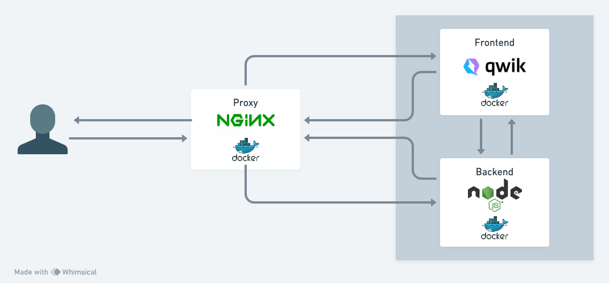

# This an example of two microservices behind a nginx proxy server



## How to build and run all microservices

### Backend
```bash
docker build -t backend . && docker run -p 4000:4000 backend
```
### Frontend
```bash
docker build -t frontend . && docker run -p 3000:3000 frontend
```
### Proxy
```bash
docker build -t proxy . && docker run -p 80:80 proxy
```
### Making requests
- Frontend: http://localhost
- Backend: http://localhost/api/v1/health

